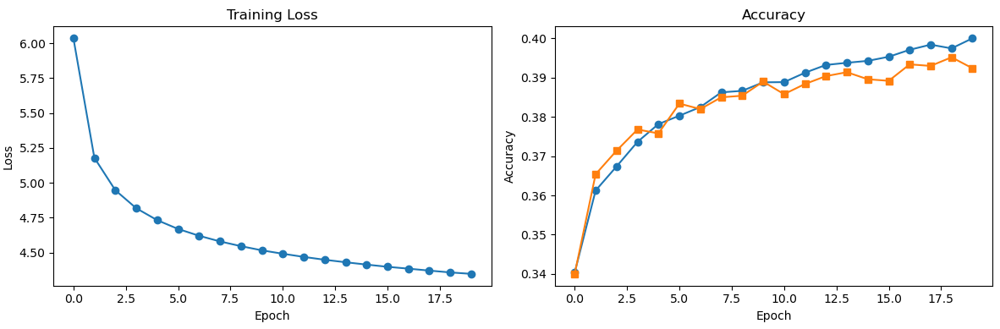
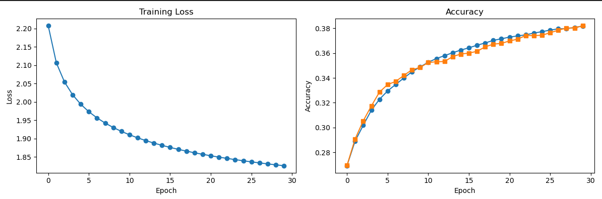

# Linear Classifiers on CIFAR-10
### Implementing linear classifiers (SVM and Softmax) from scratch using NumPy for image classification on CIFAR-10 

## Overview

### Softmax Classifier:
The softmax function takes the raw scores produced by a linear classifier for each class and converts them into a probability distribution, each score is exponentiated and then divided by the sum of all exponentiated scores

<p align="center">
  
</p>

These probabilities are then converted into loss by calculating the cross-entropy loss and adding a L2 regularization term to prevent overfitting

<p align="center">
  
</p>


### SVM Classifier (Hinge loss):
Hinge loss computes the difference between each incorrect class score and the correct class score plus the margin, if this value is positive the margin is added to the loss other wise nothing is added. 

<p align="center">
  
</p>


### SGD Optimizer:
To optimize these losses and make them as low as possible, the SGD optimizer repeatedly updates the weights in the direction of the negative gradient.

<p align="center">
  
</p>


## Results
After training the SVM model for 20 epochs with a learning rate of 0.001 and regularization strength of 0.0001, the following results were recieved:

```
python linear_classifiers/train.py --model svm --lr 1e-3 --reg 1e-4 --epochs 20
```
<p align="center">
  
</p>

an accuracy of about 31% was achieved for the training set using SVM and the traning loss consistently decreased


After training the Softmax classifier for 30 epochs with a learning rate of 0.001 and a regularization strength of 0.0005, the following results were recieved:.

```
python linear_classifiers/train.py --model softmax --lr 1e-3 --reg 5e-4 --epochs 30
```
<p align="center">
  
</p>

an accuracy of about 30.8% was achieved for the training set using softmax and the traning loss consistently decreased
